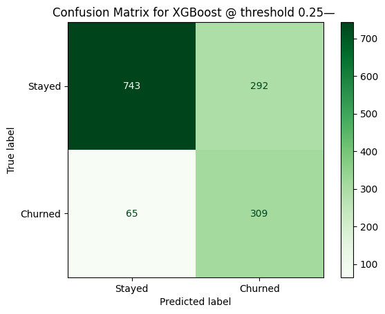
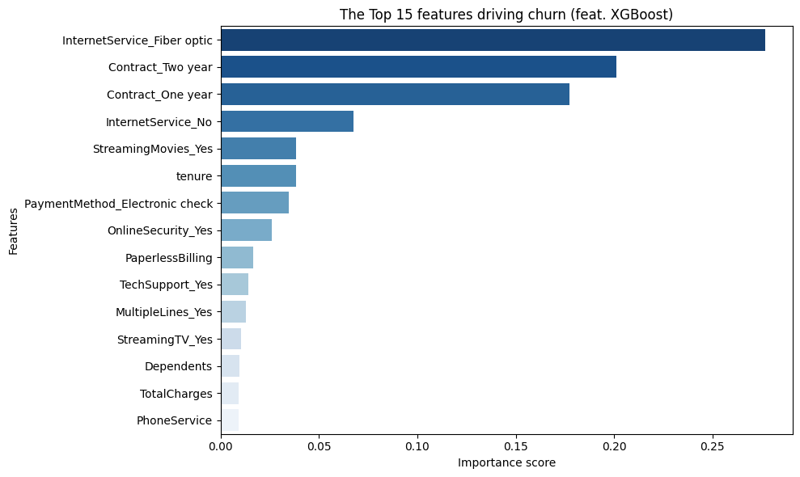
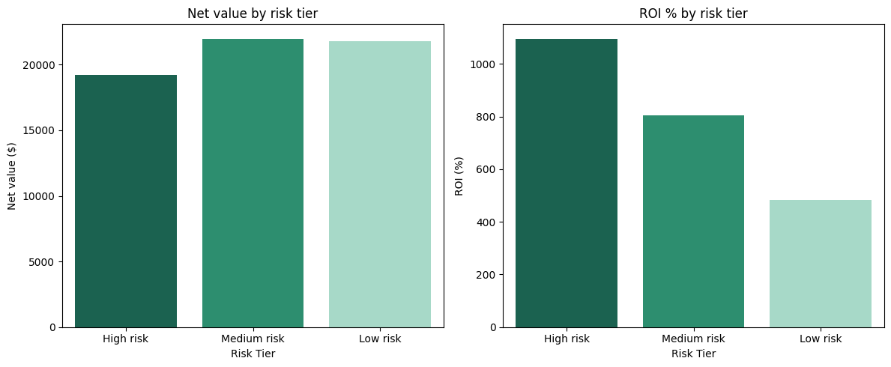

<div align="center">
    <h1>Churn Risk Analyzer</h1>
</div>

A customer churn prediction and retention ROI model built on IBM Telco data.
Predicts which customers are likely to leave, ranks them by risk, and calculates the net revenue value of a targeted retention campaign (i.e recommends the interventions worth paying for).

**Headline result:** Targeting 601 flagged customers is estimated to generate
$63,024 in net retained revenue at 699% ROI.

## Table of Contents

- [Problem Framing](#problem-framing)
- [What This Project Does](#what-this-project-does)
- [Stakeholders](#stakeholders)
- [Data](#data)
- [Modelling approach](#modelling-approach)
- [Results](#results)
- [Cost-benefit analysis](#cost-benefit-analysis)
- [Limitations](#limitations)
- [Getting Started](#getting-started)
- [Tech Stack](#tech-stack)
- [Author/Contributors](#authorcontributors)
- [License](#license)

## Problem Framing

Most businesses only know a customer churned _after_ it happened, that is, when it's too late. This project predicts churn **30–60 days in advance** using behavioural signals, so retention teams can act _before_ revenue walks out the door.

Churn prediction is a binary classification problem. The target variable is whether a customer churned (1) or stayed (0). The dataset is imbalanced —
26.5% churned, 73.5% stayed — which shapes all modelling decisions.

**Recall was chosen as the primary evaluation metric over accuracy.** A missed churner costs ~$65/month in lost revenue; a false alarm costs ~$15 in an
unnecessary retention offer. The asymmetry justifies optimising for recall.

## What This Project Does

| Layer              | Output                                               |
| ------------------ | ---------------------------------------------------- |
| **Prediction**     | Churn probability score per customer                 |
| **Prioritisation** | Ranked list of at-risk customers                     |
| **Cost-benefit**   | Which interventions are actually profitable to run   |
| **Business brief** | Revenue at risk, churn segments, recommended actions |

## Stakeholders

| Role              | How They Benefit                                   |
| ----------------- | -------------------------------------------------- |
| Marketing team    | Concentrate spend on highest-value interventions.  |
| Customer success  | Shift from reactive to proactive outreach.         |
| Business analysts | Tie model performance to measurable revenue saved. |

## Data

- **IBM Telco Customer Churn dataset via [Kaggle](https://www.kaggle.com/datasets/blastchar/telco-customer-churn)**
- **Size:** 7,043 rows × 21 columns
- **Target:** `Churn` (Yes/No became 1/0)
- **Cleaning:** `TotalCharges` col. converted from string to float (11 nulls filled with 0), `customerID` dropped, binary columns mapped to 1/0, 10 multi-category columns one-hot encoded.
  - Final shape: 7,043 rows × 30 columns.

| Feature           | Description                        |
| ----------------- | ---------------------------------- |
| `tenure`          | Months as a customer               |
| `contract_type`   | Month-to-month, one year, two year |
| `monthly_charges` | Monthly bill amount                |
| `support_calls`   | Number of support interactions     |
| `services_used`   | Add-ons and products subscribed to |
| `churn`           | Target label (Yes / No)            |

## Modelling approach

Three models were trained and evaluated:

| Model               | Rationale                                                     |
| ------------------- | ------------------------------------------------------------- |
| Logistic Regression | Interpretable baseline; performs well on linear relationships |
| Random Forest       | Ensemble method; tests non-linear pattern detection           |
| XGBoost             | Sequential boosting; strong on tabular data with imbalance    |

Evaluation included classification report, confusion matrix, ROC-AUC curve, and precision-recall curve. **Threshold tuning was applied across 0.10–0.55 to find the optimal business tradeoff between precision and recall.**

## Results

| Model               | Threshold | Recall    | Precision | F1        | AUC      |
| ------------------- | --------- | --------- | --------- | --------- | -------- |
| Logistic Regression | 0.30      | 0.757     | 0.523     | 0.619     | 0.84     |
| Random Forest       | 0.25      | 0.807     | 0.513     | 0.627     | 0.82     |
| **XGBoost**         | **0.25**  | **0.826** | **0.514** | **0.630** | **0.84** |

**Selected model:** XGBoost at threshold 0.25.

XGBoost achieved the highest recall (0.826), best F1 (0.630), and highest average precision (0.66) on the precision-recall curve. Threshold tuning reduced missed churners from 199 to 65, which is a 67% reduction.

### _XGBoost tuned confusion matrix:_



**Top churn drivers (XGBoost feature importance):**

1. Internet service: fiber optic
2. Contract type: two year (protective)
3. Contract type: one year (protective)
4. Tenure
5. Payment method: electronic check

### _Feature importance chart:_



## Cost-benefit analysis

**Assumptions:** $64.76 avg monthly revenue, $15 offer cost, 30% retention
success rate, 12-month customer lifetime.

| Tier                    | Customers | Net Value   | ROI      |
| ----------------------- | --------- | ----------- | -------- |
| High risk (≥ 0.70)      | 109       | $19,320     | 1,060%   |
| Medium risk (0.50–0.70) | 213       | $21,936     | 806%     |
| Low risk (0.25–0.50)    | 279       | $21,768     | 491%     |
| **Total**               | **601**   | **$63,024** | **699%** |

### _ROI by Tier Chart:_



## Limitations

- Dataset represents a single US telecom provider so generalisation to other
  markets or business models requires validation.
- 7,043 rows is a small dataset; performance may shift with more data
- No call log, NPS, or usage frequency data available, thus, richer behavioural
  signals would likely improve recall further
- Retention success rate of 30% is an industry benchmark, not a measured
  conversion rate for this business.
- Cost-benefit figures are estimates; actual campaign ROI depends on real
  offer costs and customer lifetime data.

## Getting Started

```bash
pip install pandas numpy matplotlib seaborn scikit-learn xgboost imbalanced-learn plotly joblib
```

Run notebooks in order:

1. `notebooks/data_exploration.ipynb`: data overview and visualisation.
2. `notebooks/cleaning.ipynb`: preprocessing and feature encoding.
3. `notebooks/modelling.ipynb`: model training, evaluation, threshold tuning.
4. `notebooks/cost_benefit.ipynb`: ROI analysis and recommendations export.

**Outputs generated:**

- `outputs/confusion_matrix_lr.png`
- `outputs/roc_curve.png`
- `outputs/precision_recall_curve.png`
- `outputs/feature_importance.png`
- `outputs/threshold_tuning.png`
- `outputs/roi_by_tier.png`
- `outputs/retention_recommendations.csv`
- `outputs/xgb_churn_model.pkl`

## Tech Stack


**Models used:** Logistic Regression · Random Forest · XGBoost
**Evaluation:** Confusion Matrix · Precision / Recall · ROC-AUC

## Author/Contributors

<p align="left"> <a href="https://github.com/Marzafiee">  </a> <br> <sub><b>marzafiee</b></sub> </p>

## License

- Distributed under the **MIT License.**
- See **LICENSE** for more information.
